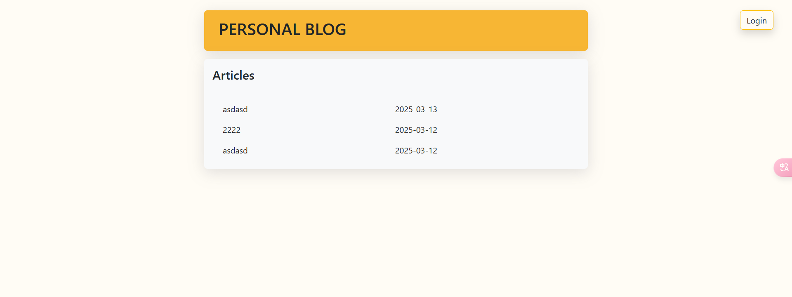
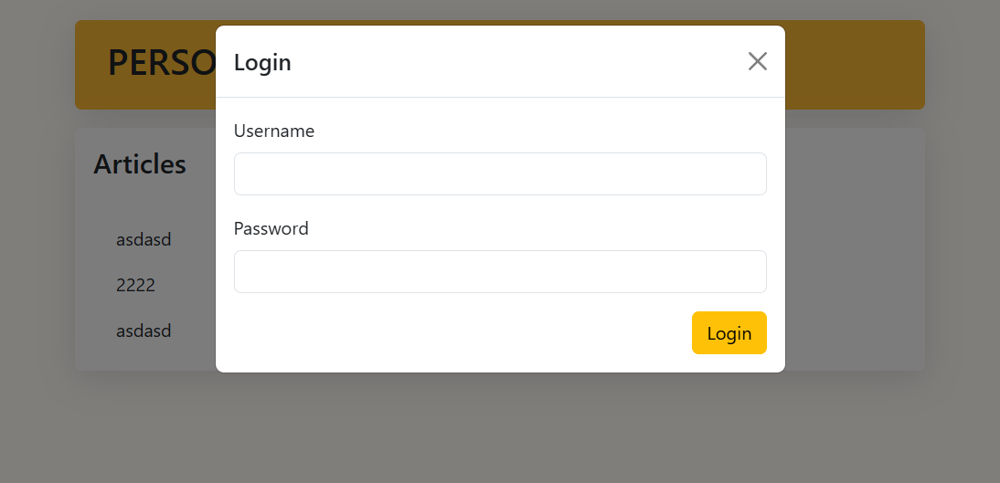
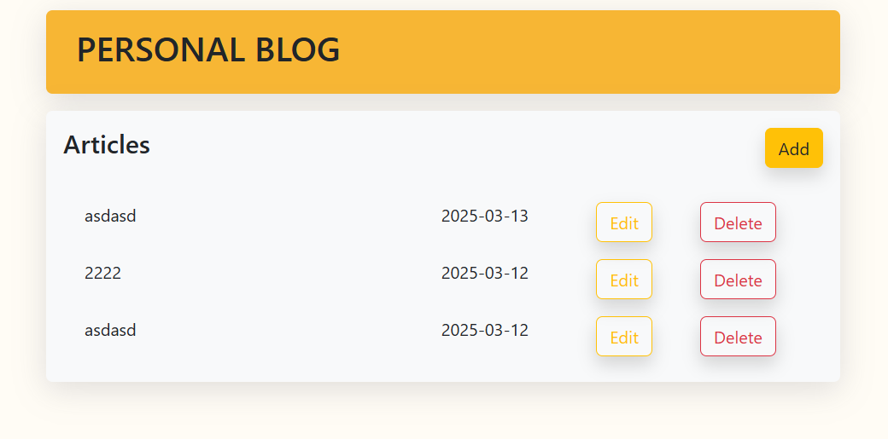
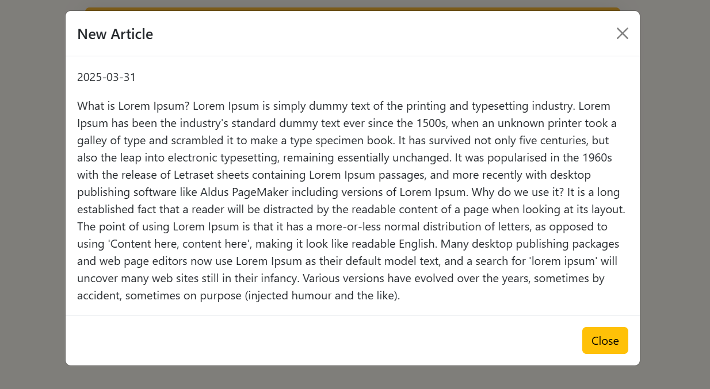
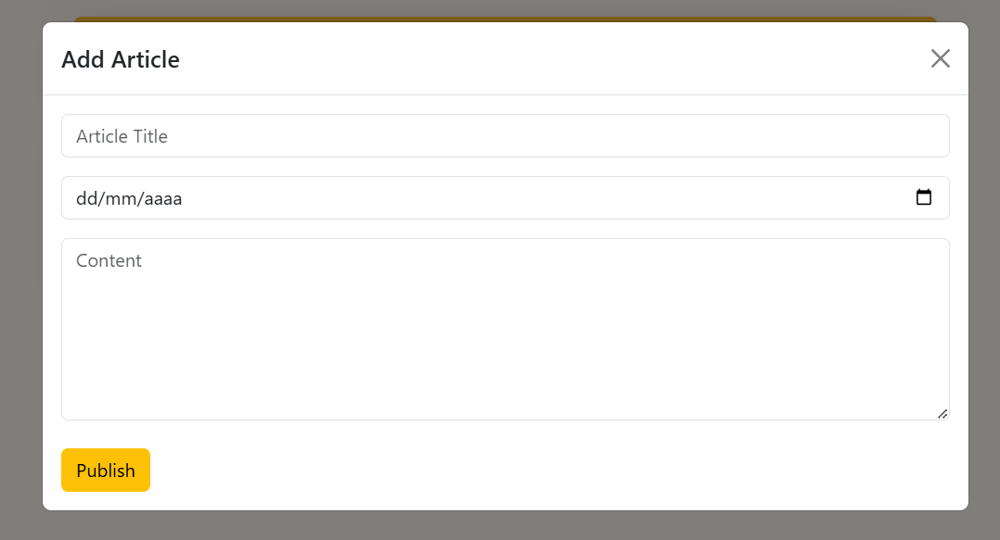

# Personal Blog Application

This is a simple personal blog application built with Spring Boot and Thymeleaf. The application allows users to view articles and administrators to create, update, and delete articles after logging in.

## Features

- View list of articles
- View individual article details in a modal
- Admin login functionality
- Create new articles
- Edit existing articles
- Delete articles
- Form validation for article creation/editing

## Technologies Used

- **Backend**:
    - Spring Boot
    - Spring MVC
    - Thymeleaf templating engine

- **Frontend**:
    - Bootstrap 5
    - jQuery
    - HTML5
    - CSS

- **Build Tool**: Maven

## Project Structure

```
src/
├── main/
│   ├── java/
│   │   └── org/personalblog/
│   │       ├── controller/        # Contains controllers
│   │       │   └── ArticleController.java
│   │       ├── model/             # Contains data models
│   │       │   ├── dto/           # Data Transfer Objects
│   │       │   ├── entity/        # Entity classes
│   │       │   └── dao/           # Data Access Objects
│   │       └── services/          # Business logic
│   │           └── ArticleService.java
│   └── resources/
│       ├── static/                # Static resources
│       │   └── styles.css
│       └── templates/             # Thymeleaf templates
│           └── index.html
```

## Getting Started

### Prerequisites

- Java 17 or higher
- Maven 3.8.1 or higher

### Installation

1. Clone the repository:
   ```bash
   git clone https://github.com/yourusername/personal-blog.git
   cd personal-blog
   ```

2. Build the project:
   ```bash
   mvn clean install
   ```

3. Run the application:
   ```bash
   mvn spring-boot:run
   ```

4. Access the application at: `http://localhost:8080/home`

## Usage

### As a Visitor
- View all articles on the home page
- Click on any article to view its details in a modal

### As an Admin
1. Click the "Login" button in the top right corner
2. Enter admin credentials (implementation depends on your DAO)
3. After successful login:
    - "Add" button appears to create new articles
    - "Edit" and "Delete" buttons appear for each article
4. Click "Logout" to end admin session

## API Endpoints

| Method | Endpoint                | Description                          |
|--------|-------------------------|--------------------------------------|
| GET    | /home                   | Home page with all articles          |
| GET    | /article/{id}           | Get specific article by ID           |
| POST   | /admin/new              | Create new article                   |
| POST   | /admin/update/{id}      | Update existing article              |
| DELETE | /admin/delete/{id}      | Delete article                       |
| GET    | /login/{username}/{pass}| Admin login                          |

## Configuration

The application uses in-memory storage through the `ArticleDao` class. For production use, you should implement a proper database connection.

## Screenshots

  
 

## Roadmap URL

[Roadmap](https://roadmap.sh/projects/personal-blog)